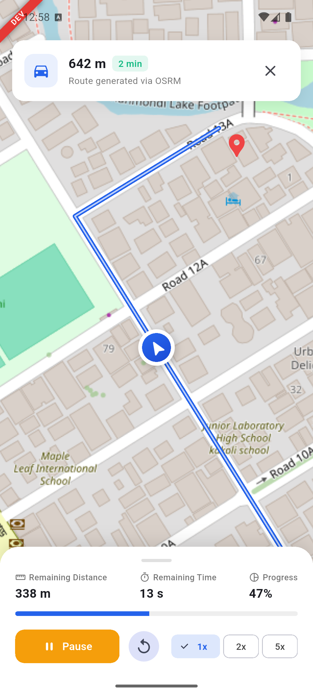
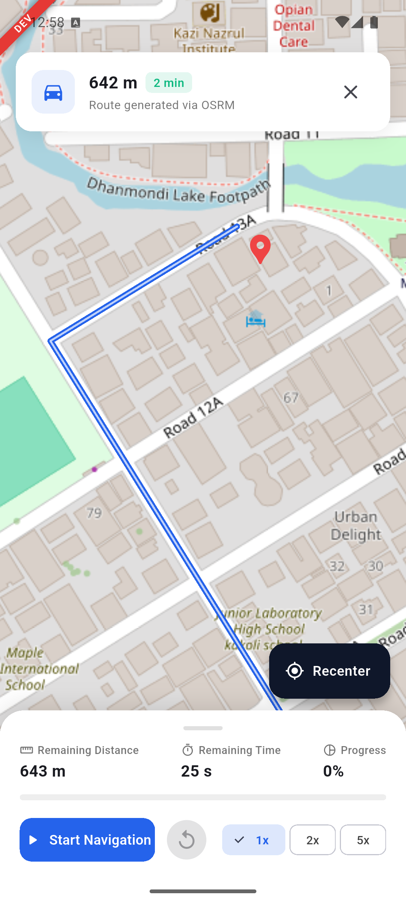
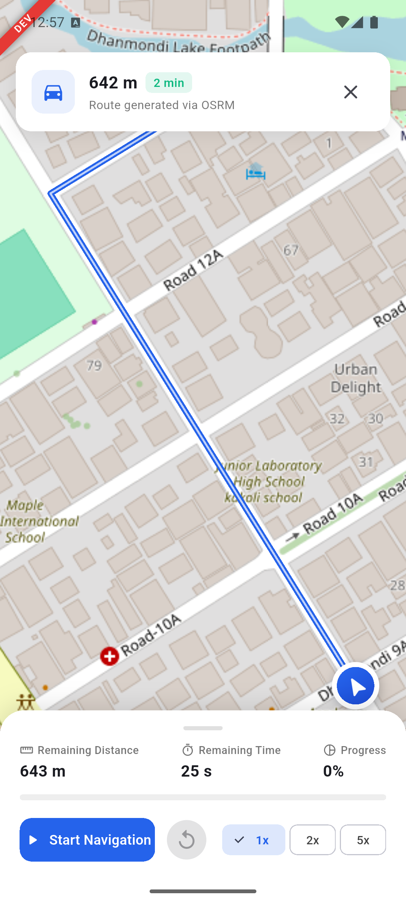
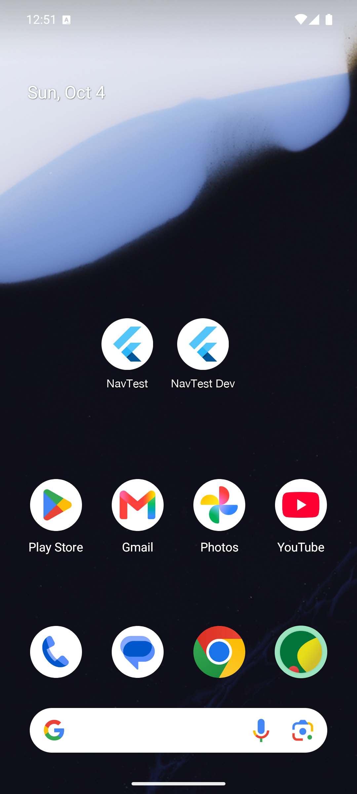

# Route & Car Navigation (NavTest)

Welcome to the Route & Car Navigation project! This is a single-screen Flutter application built for the **Senior Mobile Developer Assessment**, featuring pure native Android location tracking, OSRM driving route calculation, and constant-speed car tracking with shortest-path bearing rotation.

---

## Visual Demo Screenshots

<p align="center">
  
  
  
  
</p>

1. **Live Navigation**: Polyline route calculated via OSRM, rotating car marker, DEV watermark badge, and real-time HUD stats.
2. **Camera Recenter**: Dragging the map disengages auto-follow and reveals the floating **Recenter** button above the sheet.
3. **Playback Controls**: Controls sheet with Start, Pause, Resume, Reset, and speed multiplier toggles (**1x, 2x, 5x**).
4. **Side-by-Side Flavors**: Both **NavTest Dev** (`.dev` application ID) and **NavTest** (production) installed together on the device.

---

## Architecture & Code Structure

The project strictly follows **Clean Architecture** patterns combined with **Bloc** for predictable state management, decoupling business logic entirely from UI widgets:

```
lib/
├── environment.dart                   # Environment & flavor configs (Dev/Prod, base URLs)
├── main.dart                          # Default entry point (runs dev)
├── main_dev.dart                      # Development entry point (NavTest Dev)
├── main_prod.dart                     # Production entry point (NavTest)
└── app/
    ├── app.dart                       # Root NavTestApp widget with MultiBlocProvider
    ├── components/
    │   └── dev_banner.dart            # Watermark badge component for Dev flavor
    ├── core/
    │   ├── di/
    │   │   ├── app_bloc_observer.dart # Global BLoC state transition logging
    │   │   └── injection_container.dart # GetIt dependency injection registry
    │   ├── exceptions/
    │   │   ├── app_exception.dart     # Base application failure hierarchy
    │   │   ├── location_failure.dart  # Strongly typed native location exceptions
    │   │   └── route_failure.dart     # Strongly typed OSRM routing exceptions
    │   ├── network/
    │   │   ├── api_client.dart        # Global Dio client with interceptors
    │   │   ├── interceptor/           # Header and logging interceptors
    │   │   └── osrm_client.dart       # OSRM API service & Polyline 5 decoder
    │   ├── service/
    │   │   └── location_service.dart  # Native MethodChannel & EventChannel bridge
    │   ├── shared/
    │   │   └── data/model/
    │   │       └── api_response_model.dart # Generic ApiResponse wrapper
    │   ├── theme/
    │   │   └── app_theme.dart         # Design tokens, color palette, and themes
    │   └── utils/
    │       ├── geo_math.dart          # Haversine distance, bearing, and interpolation
    │       └── shortest_bearing.dart  # Shortest angular delta calculations
    ├── features/
    │   └── navigation/
    │       ├── data/
    │       │   ├── datasources/       # RouteRemoteDataSourceImpl
    │       │   ├── models/            # RouteModel mapping
    │       │   └── repositories/      # LocationRepositoryImpl & RouteRepositoryImpl
    │       ├── domain/
    │       │   ├── entities/          # NavigationRoute, UserLocation, AnimatedCarState
    │       │   ├── repositories/      # LocationRepository & RouteRepository contracts
    │       │   └── usecases/          # Single-responsibility business use cases
    │       └── presentation/
    │           ├── bloc/
    │           │   ├── location/      # LocationBloc (permissions & GPS stream)
    │           │   ├── route/         # RouteBloc (debouncing & restartable concurrency)
    │           │   └── car_animation/ # CarAnimationBloc (decoupled animation engine)
    │           ├── screens/
    │           │   └── navigation_screen.dart # Interactive map with camera auto-follow
    │           └── widgets/
    │               ├── car_marker.dart
    │               ├── map_recenter_button.dart
    │               ├── navigation_controls_sheet.dart
    │               ├── permission_primer_dialog.dart
    │               └── route_info_card.dart
    └── router/
        └── app_router.dart            # Centralized application routing
```

### Architectural Highlights
- **Decoupled Animation Engine**: All car animation, distance progression, speed scaling, and shortest-turn math live inside `CarAnimationBloc`. It can be tested in pure Dart without creating any map widgets or emulators.
- **Race-Condition Safety**: The `RouteBloc` uses `bloc_concurrency`'s `restartable()` transformer and 600ms debouncing. When the user taps a new destination, in-flight requests are immediately cancelled so old data never overwrites new routes.
- **Strict Resource Disposal**: All subscriptions (`EventChannel` streams, periodic timers, controllers) are cleanly disposed in `close()` / `dispose()`, preventing background battery drain.

---

## Quick Start: How to Run the App

Make sure an Android device or emulator is connected, then run:

### 1. Run Development Flavor (NavTest Dev)
```bash
flutter run --flavor dev -t lib/main_dev.dart
```
*Installs `NavTest Dev` (`com.akt.navigation.route_and_car_navigation.dev`) with the visible red DEV banner.*

### 2. Run Production Flavor (NavTest)
```bash
flutter run --flavor prod -t lib/main_prod.dart
```
*Installs `NavTest` (`com.akt.navigation.route_and_car_navigation`) clean without badges.*

### 3. Run Unit Tests
```bash
flutter test
```
*Runs all geodesic math, shortest-path bearing, and edge-case unit tests headlessly.*

---

## Packages Used

| Package | Version | Purpose |
|---|---|---|
| **flutter_bloc** | `^9.1.1` | Predictable event-driven state management |
| **bloc_concurrency** | `^0.3.0` | Event transformers (`restartable` for race-condition prevention) |
| **dio** | `^5.11.1` | Network client with interceptors and timeout handling |
| **flutter_map** | `^8.3.2` | OpenStreetMap rendering with tile policy compliance |
| **latlong2** | `^0.10.1` | Geodesic coordinate calculation helpers |
| **get_it** | `^9.3.0` | Service locator dependency injection |
| **equatable** | `^3.0.0` | Value equality for states, events, and entities |
| **play-services-location** | `21.3.0` (Android) | Pure native Kotlin Fused Location Provider |

---

## Known Limitations & Assumptions

1. **Public OSRM Demo Server**: The default endpoint (`router.project-osrm.org`) is a shared demo server with ~1 req/sec rate limits. Requests are throttled and debounced to prevent server flooding.
2. **Free Keyless Map**: Built strictly with OpenStreetMap tiles and proper attribution. No paid API keys (Google Maps, Mapbox) are used.
3. **Android Priority**: Native location is implemented in Kotlin. iOS platform calls return a graceful typed `PlatformNotSupportedException` without crashing.
